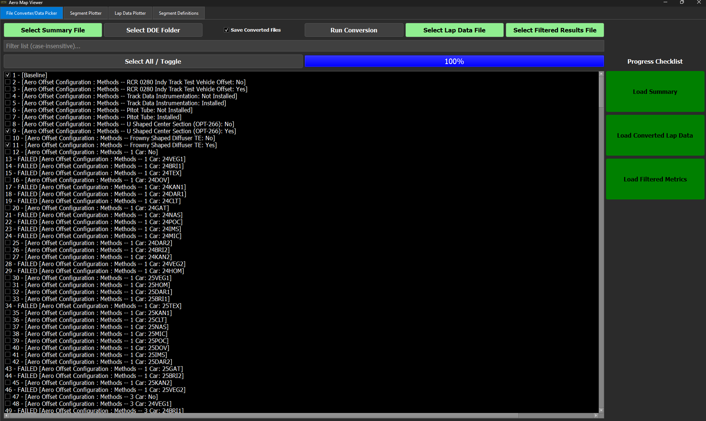
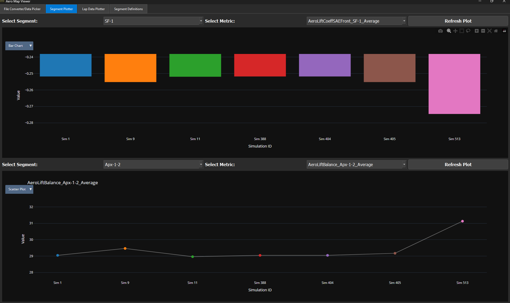
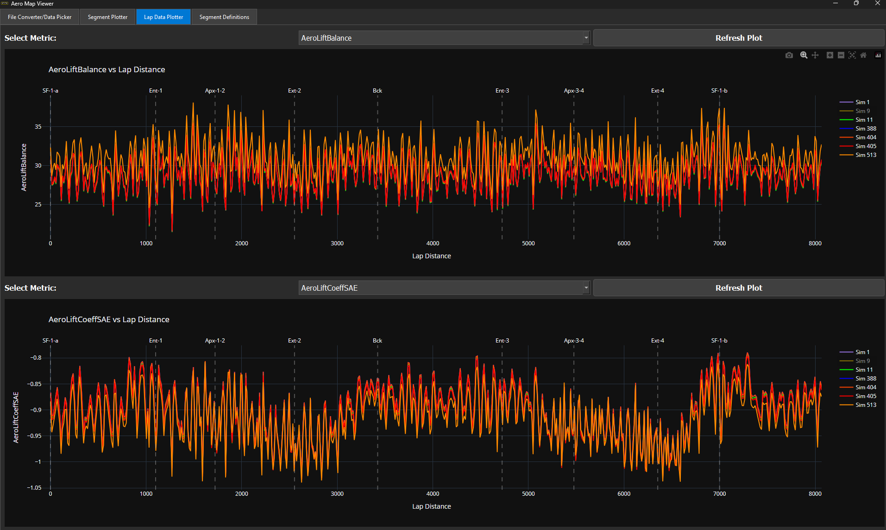
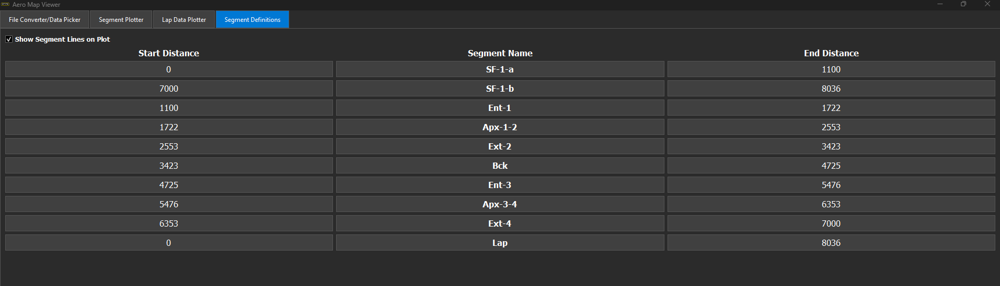

# Aero Map Explorer
(View web version of this file) [https://github.com/SPM-VD/Public-README-Files/blob/main/AeroMapViewer_README.md]

- Application to view the new changes allowed with the dev C3 aero map.
- DOE was ran with every possible new addition to the aero map
	- Sim file used was (25VEG2_7_Shop Final_L15) [https://spireracing.sharepoint.com/:u:/s/2024SpireRaceEngineering/IQDXBS07Ct6XT6n852Ym7wI6AdY_VDNWt_Lzx_FtPsJ6b7c?e=j6gryM]
 - List of runs is available: (Runs List) [placeholder.com]

## How to Use:

### File Converter/Data Picker

If using pre made files, follow these steps:
1. Select Summary File
  - Click the Select Summary File button and select a Summary File (provided file is named: 25VEG2_7_SF_devC3AM_batch_v3_Summary.csv)
	- This will load in the file and create a list of all available runs. Please wait for the progress bar to fill before doing anything else.
2. Select Lap Data File
	- Click the button and select a lap data .pkl file (provided file is named: 25VEG2_7_SF_devC3AM_LAP_DATA.pkl)
	- Button and checklist icon will turn green once it is loaded
3. Select Filtered Results File
	- Click the button and select a filtered results file (provided file is named: 25VEG2_7_SF_devC3AM_batch_v3_FilteredResults.csv)
	- Again, the button and checklist icon will turn green once it is loaded
4. Select runs to be shown
	- Using the list of checkboxes, select what runs you want to see plotted on the next pages.
	- You can use the Filter List edit box to filter the list to what you want to see, and use the Select All button if desired.
	  - **Note:** Selecting more than 10 will slow down the Lap Data Plotter due to amount of data, the Segment Plotter will continue to work smoothly.

### Segment Plotter

1. This uses the Filtered Results file, make sure it is loaded before trying.
2. Click on the Segment Plotter tab. It will show 2 plots.
3. Use the Segment Dropdowns to select what segment you want to see, and then select the metric dropdown to change what sim output you want to see
4. On the top left corner of both plots, you can change it to a Bar Plot or the default Scatter Plot
5. After any changes, either to the checklist on the first page, or the metrics, Hit Refresh Plot if it has not updated.
6. Hover over the data points/bars to see a detailed description of them.

### Lap Data Plotter

1. This uses the Lap Data file, make sure it is loaded before trying.
2. Hit Refresh Plot to load plots.
3. Use the Metric dropdown to change what sim output to see.
4. Hover over the lines to see a detailed description
5. Click and drag to zoom, either hit the home button in the top right of the plot area, or right click and hit Reload to reset the zoom.

### Segment Definitions

1. Use this page to set the segments for the Lap Data Plotter
2. Hit the checkbox in the top left corner to toggle the lines being shown or not

## Creating your own Batch File to run
1. Open your sim file and go to the Simulation tab, then to Metric Options
2. In the track segments box, wait for it to load after clicking and find your track. Select the 7BC option
3. Then beside the filter name box, hit the load filter button and select the provided filter file (you can add or take away from this if you'd like, just do not get rid of LapDistance or Distance options)
  - (provided file is aeroMapViewerFilter.mfs)
4. Make sure you have the new aero map loaded in the setup page
5. Go to the DOEs tab, hit the Static Option
  - Set the sliders to this:
  - 
6. Hit the Batch Builder tab
7. Open Batch and select the provided batch file: devC3AM_batch_v3.doeb
  - Runs list should be 517. If it is less than that, then the new DEV C3 map is not loaded. Do that then repeat this step
8. Change the run name if needed, then hti Send DOE
9. Once DOE is completed, click the checkbox beside it in the Batch List and export both the Summary and Filtered Metrics
  - If you changed sims once it was running, that's fine. But make sure to reload the filter before exporting.
10. To get the lap data, reselect the checkbox and hit Download Files
    - Select CSV then Filter, then under Sim IDs type in 1:517 then download
    - **NOTE**: this will download timestamp CSV data for every file in the run, each file can be around 2.4 MB, store on a seperate folder.
    - This process will take a little bit of time and has no success message from the Sim, so check your output directory to make sure they are all there.
   
### Converting Lap Data Files
1. Hit the Select DOE Folder button and select which folder the lap data is in.
  - Please make sure that the filtered results and summary are not in this same folder.
2. Select the summary file so that the saved file can have the correct Identifiers
3. Once both are loaded, the Run Conversion button becomes available
4. Hit it and let the script run.
5. This will convert it into a pickle file, which is a serialized version of the data frame that python uses. This dramatically reduces the file size of all the lap data files.

    

