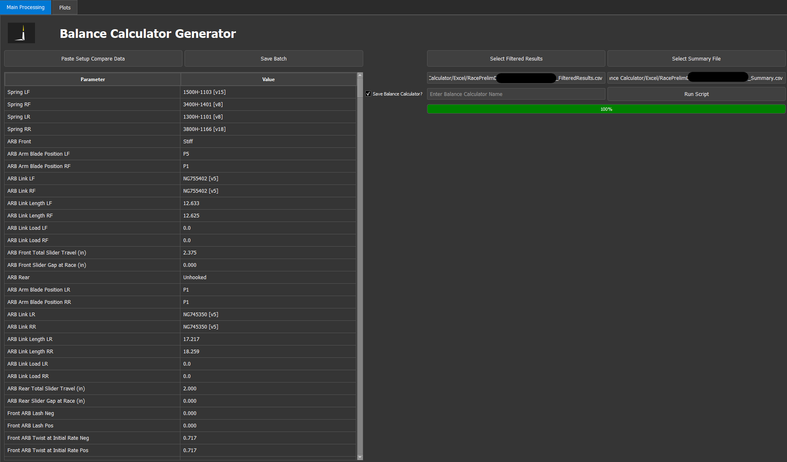
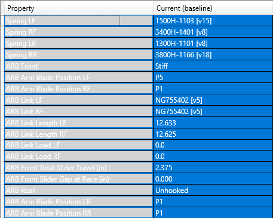
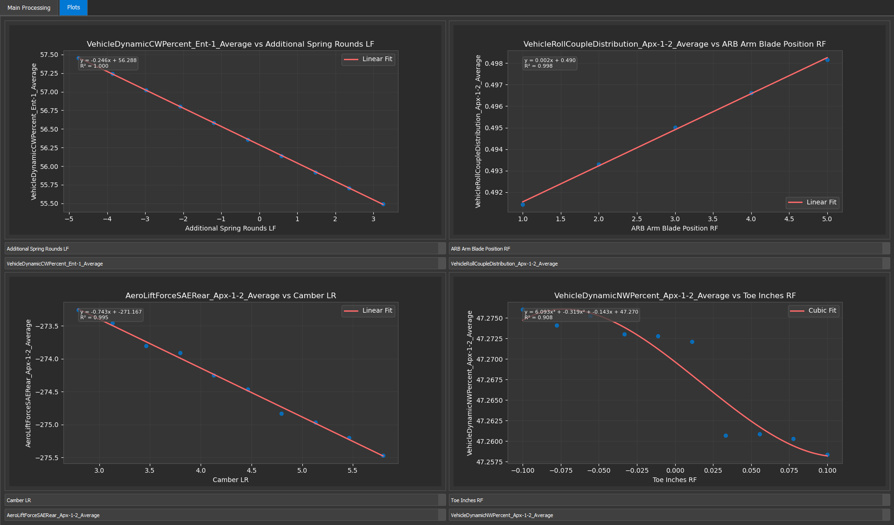
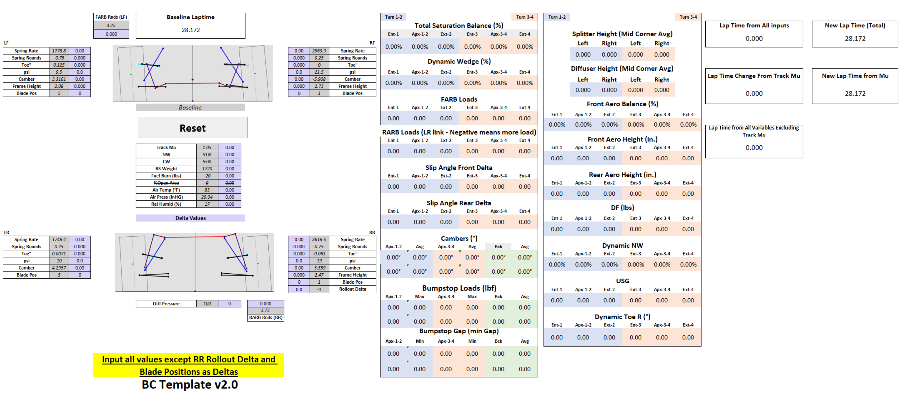

# Balance Calculator Generator
View Web Version here: https://github.com/SPM-VD/Public-README-Files/blob/dffd093501588a015e4b8d0e88eac859dcfdd664/BalanceCalculator_README.md

Before Use, run the "create_shortcut_exe.vbs" file to create shortcuts for the app

## How to Use

### Generating Batches
- Open your sim file, assemble and setup. 
- Click on the Setup Compare tab
- Select all values under the Property and Current columns
    - Keyboard shortcut is select the first row (just Property and Current), then Ctrl+Shift+DownArrow
- 

- Click "Paste Setup Compare Data"
    - Message should show if there was an error. Usually as a result of not assembling or selecting everything
- Click "Save Batch"
    - Save the batch file to a place you can reach again, will use again soon.

### Setting up Metric Options
- Click on Simulation tab, then Metric Options
- Select track segments
- Most segments that are for this have 7BC attached to it, in white textboxes.
- If creating your own segments, recommend to follow the same format. 
    - Refer to RVG to edit/make copies.
- Under Result Metric Filtering, select the provided "BalanceCalc2025Filter.mfs" file
    - Can add/delete to this. But be careful not to add too many or you will need to adjust the ranges in the balance calculator excel sheet

### Running the DOE
- Click the DOEs page, then Static
- Set settings to the following:
    - 
- Click Batch Builder, then DOE Batches to get back to main page. 
- Click Send DOE, select the batch file from earlier, and send. 
- Once completed, select the DOE file, and download the following:
    - Export DOE Summary
    - Export Filtered DOE Metrics
        - Make sure the filter is still set if you changed sim files since sending the batch

### Running the Script
- Select both the Filtered Results and Summary file
- Enter a name for the balance calculator.
    - If no name is entered, then it will use the batch name and add "_BalanceCalculator"
    - File is saved in the same directory as filtered results
- To just see the curve fit plots, uncheck the Save Balance Calculator Option
- Otherwise, hit **Run Script**

### Plot Viewer Tab
- Under each plot box, there are 2 dropdowns.
- The first is a parameter name for the x axis
- The second is an output name for the y axis
- Select both to plot one against the other
- 

# Balance Calculator Sheet

## Walkthrough

### How to Use main page
- Gray boxes contain baseline setup info
- Purple boxes are where you enter deltas
- The only parameters to not input as deltas is Blade Positions and RR rollout delta. Use absolutes for this.
- All outputs to the right are deltas from baseline.
- If using different segment names (not recommended), change the gray box dropdowns in row 6, starting at column U
    - Additional output to change at Y36

### Bumpstop Viewer
- Shows plots for bumpstop forces. 
- Select x and y values within the yellow outlined boxes

### Sensitivity Viewer
- Shows slope of linear curve fit from each parameter and the output outlined in the yellow box

