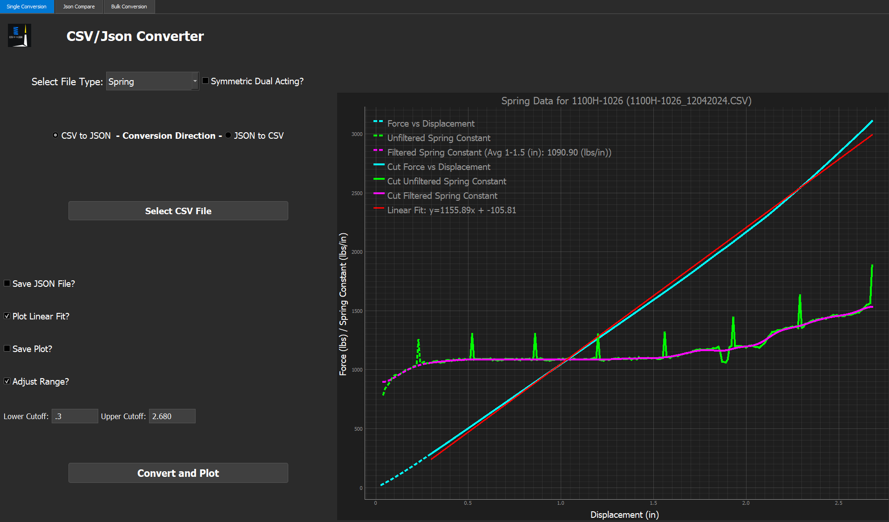
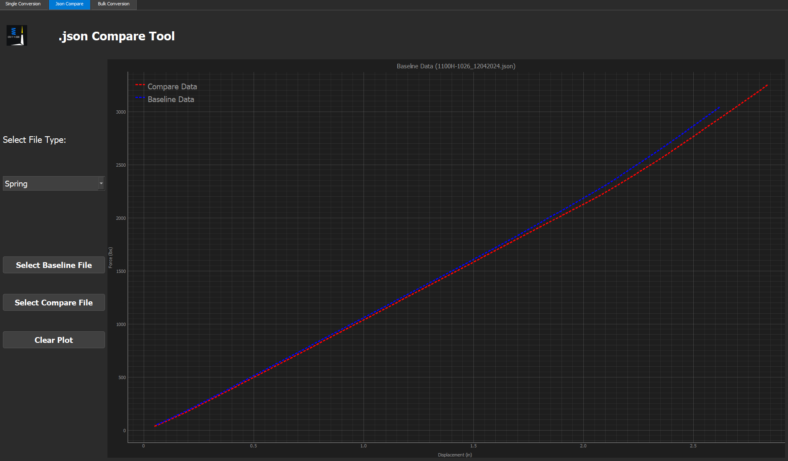
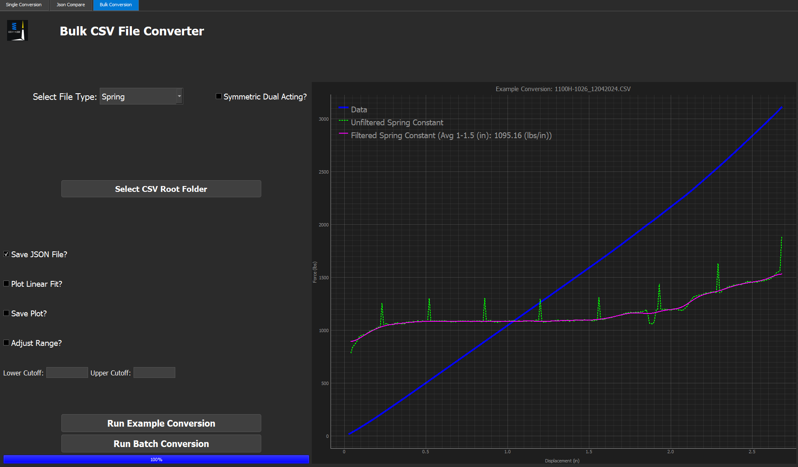

# CSV JSON Converter

To access web version: [https://github.com/SPM-VD/Public-README-Files/blob/9748c59ac26e91123d1e83a00dd2cc6d45dff87c/CSVJSONConverter_README.md
](https://github.com/SPM-VD/Public-README-Files/blob/main/CSVJSONConverter_README.md)
- Run create_shortcuts_exe.vbs once unzipping

## Single Conversion

### 1. Load File
- Select file type from dropdown 
    - Spring / Compliant Link / Bumpstop
    - Clears the plot area upon change. 
- If Compliant Link, Select Symmetric Dual Acting if needed
- Select Conversion Direction
    - Note: If converting from json to csv from an already processed file, results may not 
    match the original csv due to missing offsets aquired in the original csv processing.
    Results will match the post processed version of the csv before it was converted. 
- Plot will automatically load upon file selection
- Legend for spring rates will show the average spring rate across the 1 -> 1.5" range
    - If range doesn't exist, median 10 values are used. 

### 2. Input Choices
- Save JSON/CSV File
    - Checkbox will change depending on conversion direction
    - If selected, will save the converted file to the folder in which you selected the 
    original file
- Plot Linear Fit/Rate?
    - Just for plotting purposes. Does not affect json/csv output
    - For springs and compliant links, will plot a linear curve fit of the active data
    - For bumpstops, plots a rate vs displacement line. 
- Save Plot?
    - Saves the active plot area
- Adjust Range?
    - Allows user to set lower and upper bounds on the plot (x-axis). This cut data is 
    used in the output file.

- Select Convert and Plot after changing your selections to run the script.

## Json Compare

### 1. Load Files
- Select File Type
- Add Files to show on plot
- Clear Plot when needed

## Bulk Conversion

### 1. Load Folder
- Select File type
- Select Root folder which contains all the csv files
    - Recommended to have the folder either stored locally, or kept on device from cloud

### 2. Run Conversion
- Select inputs
- Click **Run Example Conversion** to run the first file from the selected folder
- Click **Run Batch Conversion** to run the script for all files in the selected folder
    - Make sure you have the Save options selected if desired before running.
    - The Save CSV File option will save a csv in the root folder containing average spring rates
      for all springs within the directory. Option is only available for springs.

