# Chassis DoE Viewer/Tool
View Web Version [here](https://github.com/SPM-VD/Public-README-Files/blob/main/ChassisDOEapp_README.md)

Before Use, run the "create_shortcut_exe.vbs" file to create shortcuts for the app

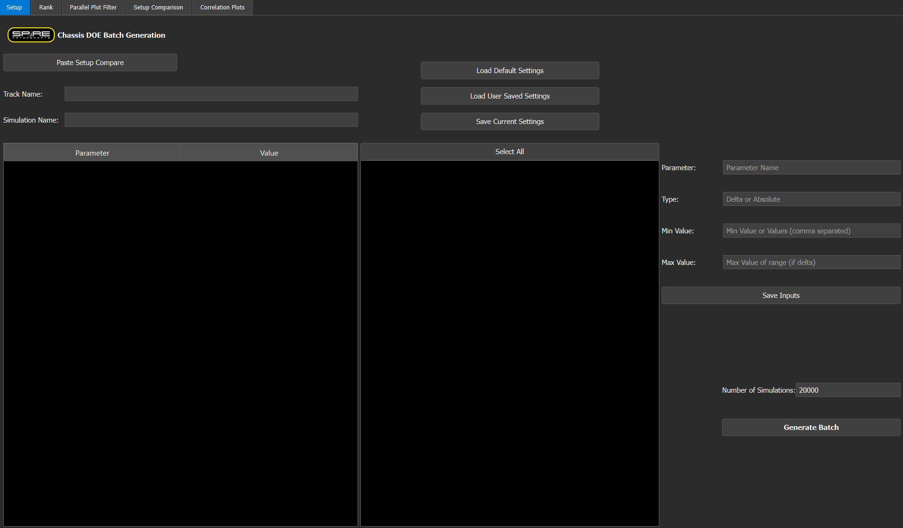

## Generating Batches
- Open your sim file, assemble and setup. 
- Click on the Setup Compare tab
- Select all values under the Property and Current columns
    - Keyboard shortcut is select the first row (just the first two columns), then Ctrl+Shift+DownArrow, then Ctrl+C
- 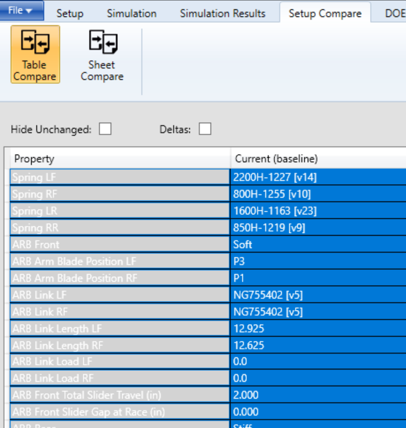

- Click "Paste Setup Compare" in the app
    - Message should show if there was an error. Usually as a result of not assembling or selecting everything
    - Track/Sim Name will fill out, along with the rest of the model data.
    - The batch inputs will display as well
    - 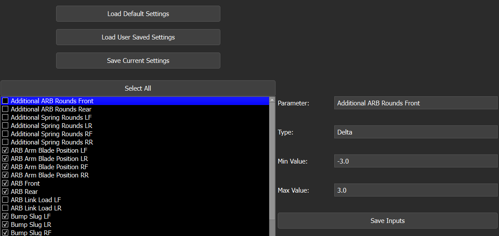
    - Clicking on one of the items will display its information to the right hand side
    - For delta values, you can change the range that the batch is allowed to create from your baseline value
    - For values which are based on a selection rather than numerical input, it will be displayed as Type Abs or absolute
        - 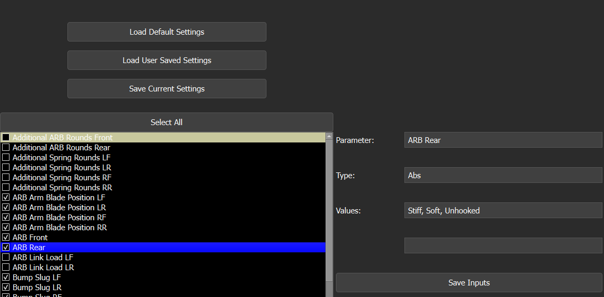
        - To change these, delete the item from the comma seperated list. 
        - For example, if the batch should not use Rear ARB Unhooked as an option, change the values input from "Stiff, Soft, Unhooked" to "Stiff, Soft"
    - When you change a value, make sure to hit the "Save Inputs" button. This will highlight the line in yellow to indicate it has not been saved to a template file.
    - You do not have to save to a template file to create the batch, if you have multiple yellow lines it will create the batch in that current state. It will just default back next time.
    - Hit the "Save Current Settings" button to save the checked parameters as a template batch inputs file. 
        - Recommend to use distinct naming convention to not get confused later with rank criteria templates.

- Change the number of simulations to run in the bottom right. Recommend at least 10000 for a Springs/Heights/Weights/Alignment DOE
    - For Geometry sweeps, +20000
- Hit "Generate Batch" to save the batch file to send through the DOE system in ngSim

## Running the DOE Batch
- Click on the Simulation tab, then Metric Options
1. Select the track segments (details can be found in [RVG](https://rvg.gm-motorsports.com/Spire/sites))
2. Select the filter set provided
    - 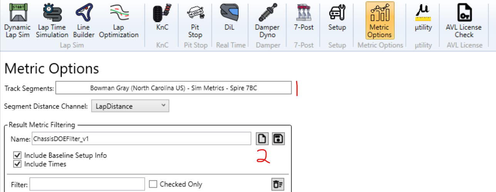
- Go to the DOE Tab, then Static
    - Select the following
    - 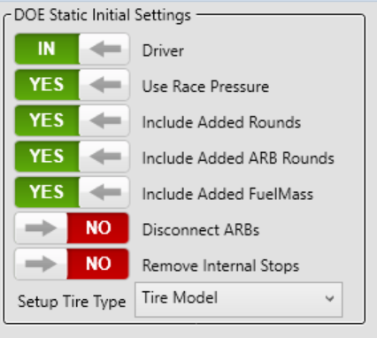
- Hit the Batch Builder button, then the DOE Batches button to bring you back to the main page. 
- 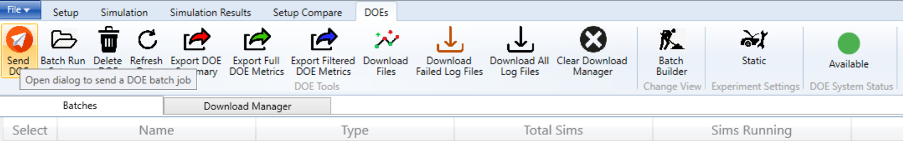
- Hit Send DOE
    - Select the batch generated from the app beside the Batch Job Filepath box
    - Change the name if desired, add key identifying features such as LTS or DLS (recommend LTS for this), condition set ran on, baseline model information
    - Change experiment type to LTS
        - Make sure baseline file has recommended LTS settings, shared either in SPM settings document or in Common - VD OneNote
        - Hit send, don't run as deltas or locally
- Hit Refresh Data to update the progress of the DOE
    - Don't run large scale DOEs (+7500) during the day, it will backlog the queue.
- Once the process is started, you can change what sim you are working on and run offline simulations.

- To download the files go back to the metric options and make sure the filter set is loaded.
    - Select the checkbox beside the doe you ran
    - Click Export Filtered DOE Metrics and save
    - If a large amount of sims failed, export the summary as well
        - The app has a report feature to give information on what parameters may have caused the failures.

## Rank Page
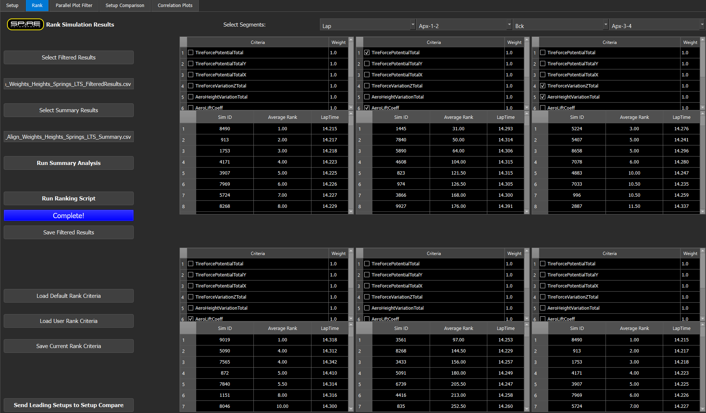

### Load Results File and Start Rank
- Select your Filtered Results file by clicking the button
    - Wait until the filepath appears
- Default rank criteria is loaded, there are options to make your own and save templates as well
- In each of the tables, are the available ranking metrics
    - The rank algorithm uses a weighted average based on what metrics are selected, and the given weight of each
    - Select and deselect to change what is being ranked for each of the loaded sims, and change the weight to match your given goal
    - If using LTS, just ranking by laptime after some filtering is a viable option as well
    - To change what segments are being used in the rank, change the dropdowns in the top right.
- Hit the Run Ranking Script button to begin the algorithm, a progress bar will display.
- The bottom halves of each table will display the ranked Sim IDs, their rank value and Laptime

### See summary results
- To see reasons as to why your DOE had a large fail rate, load in the summary file and run the summary analysis
    - A txt file will be saved to the same directory as the summary file
    - A rank of each parameters affect is attempted using Cohen's D
    - A short description is provided in the examples section of this github repository (LINK HERE)

## Parallel Plot Filter
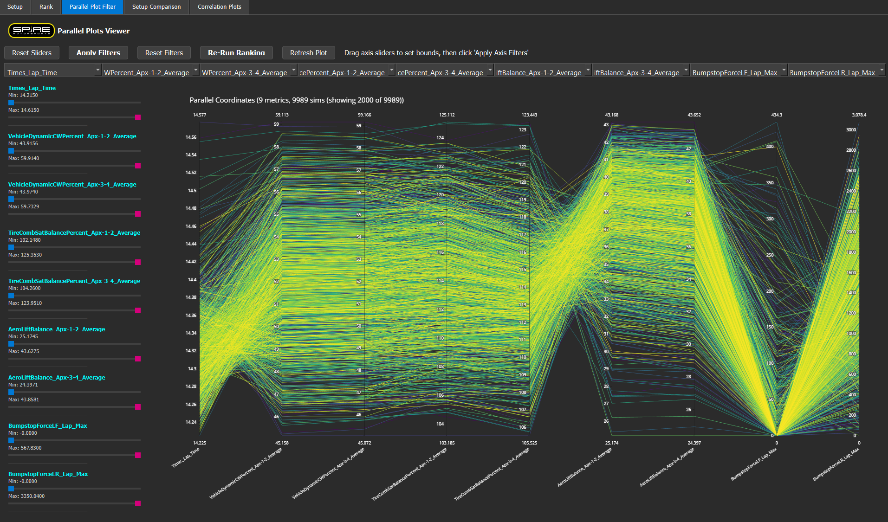

### Filtering Data
- A default selection of filter parameters are chosen, these include laptime, DynCW, SatBalance, AeroLiftBalance, and Bumpstop Force LF/LR
- Click the dropdowns and either type or find what you would like to filter by
- On the left hand side are the slider filters, adjust these to the bounds you want to keep those parameters in
- Once you have your bounds set, hit Apply Filters
    - The plot should automatically update, but if it does not, hit Refresh Plot.
    - The plot will only show a random 2000 sims at a time, to limit lag
- If you'd like to see some trends, hover over the vertical axis, click and drag up or down and a pink bar will apear, highliting the sim ID's within that criteria
    - Note, this does not filter the data, you still need to use the sliders to do that
    - 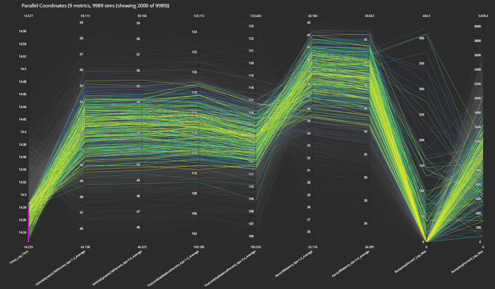
- Hit Reset Sliders to revert back what was changed before filtering, and hit Reset Filters to reset the data set entirely
- You can use the Re-Run Ranking button to go ahead and re rank the filtered data set, or go back and use the button on the Rank Page
    - The button on the Rank page will turn orange, indicating that there is new filtered data that the tables do not represent.
- Once your filter values have been set, you can Save Filtered Results on the rank page to save the current filtered data set for later use

## Setup Comparison
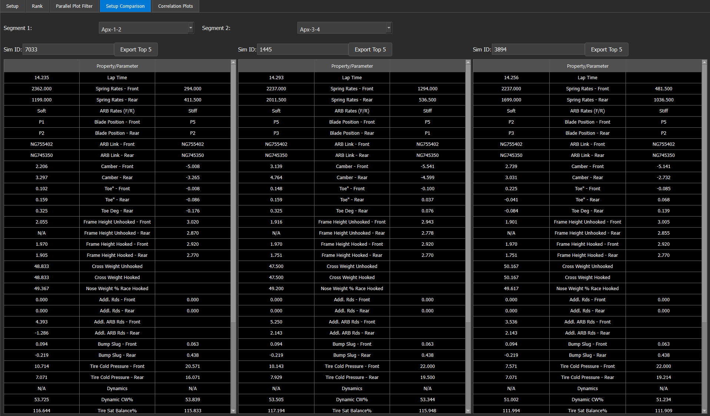

- This page displays some basic setup information and some dynamic balance metrics and forces for certain Sim IDs
- The Sim ID box for each table is automatically filled with the best from the top 3 tables in the rank page
- The dynamic values displayed are based on what segemnt is selected in the top dropdowns
- To see another sim setup, type in the value in the box. Remember that Sim ID 1 is the baseline sim
- The Export Top 5 buttons export the setup information for each of the 5 highest ranked sims from those top 3 rank tables
    - Changing the sim ID does not include it in the export, it only reports based on the rank tables
    - The excel sheet generated will print the top 5, an average of all 5, and then the baseline sim as well

## Correlation Plots
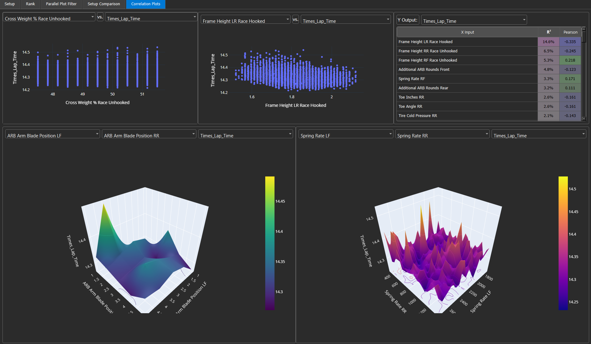

- In the top right is a sensitvity table. It is ranked by a R^2 value and a Pearson Correlation Coefficient
    - The R^2 value is calculated thru either a linear or 3rd degree polynomial fit. The goal is to show correlation to a mathematical fit
    - The Pearson Correlation Coefficient is a measure of linearity direction and correlation. 1 being perfectly linear, 0 being no correlation. 
        - Negative values would mean an inverse relationship. Learn more ([here](https://www.scribbr.com/statistics/pearson-correlation-coefficient/))
- Use the dropdowns above each plot to change what is being plotted on each axis.
