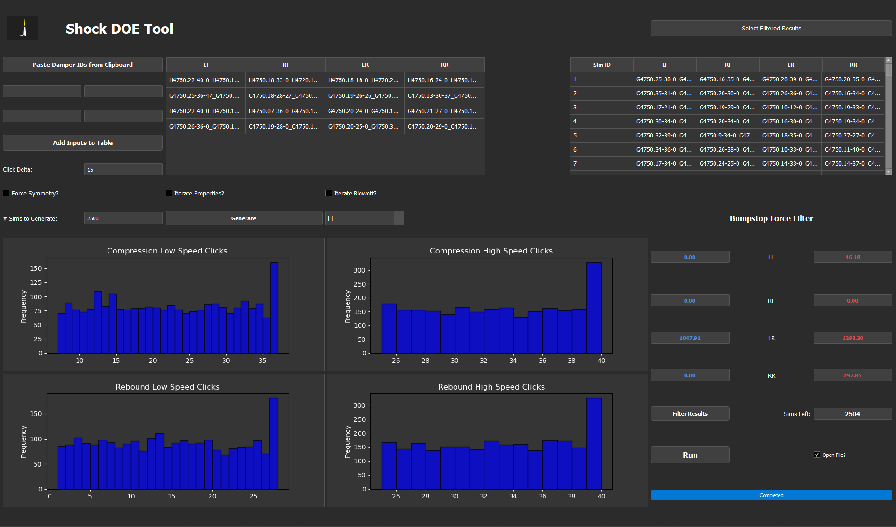
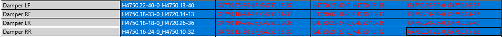
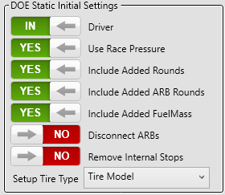

# Shock-DOE-Application

To access web version: 

## Setting baseline IDs

There are two options for filling out the input table:

### 1. Paste Damper IDs from Clipboard
- Can select as many as you want, but must follow the layout shown in the Setup Compare
  
  
  
- **NOTE:** Table clears when pressing the paste button

### 2. Add Inputs to Table
- Enter Damper IDs into the 4 boxes, then press the Add button
- This will add in addition to what's already in the table

## Generating the Batch

### 1. Set Batch Settings
- Click Delta
    - Max delta of clicks that the random iterations can be from your baseline
        - If not within possible range, its set to max/min possible

- Check boxes
    - Force Symmetry?
        - Forces symmetry for dampers, doesn't mess with baseline inputs
    - Iterate Properties?
        - Allows iteration of valves and springs
    - Iterate Blowoff?
        - Allows iteration of blowoff clicks. Follows the same rules as click delta

- Num Sims to Generate
    - How many random iterations to generate. Default to 2500. If iterating properties,
    recommend to increase to at least 3500.

### 2. Generate
- Clicking the generate button will prompt for the user to save the created batch file.
    - Keep track of this, will need it to use in Sim

### 3. Histogram Plots
- Plots are generated for click values in the generated batch file.
- Includes the values from baseline dampers.
- Spikes around the max/min values are normal since it defaults to that when it would
    exceed
- Click the dropdown beside the Generate Button to select the corner to look at.
    - Purpose is to make sure a generally even distribution is created. 
    - If too unbalanced, generate batch again to attempt to improve.

## Running the batch

### Setting Metric Options
- In GM Sim, click the simulation tab, then Metric Options
- Select Track Segment 
    - This will pull up an RVG import widget
    - Segments should be made for every track.
    - Created ones are in white textboxes, and have "Shock DOE" or "Alt Sim Segments"
    attached to it.
    - **NOTE: If you create your own, make sure to include a "Lap" section. Needed for script to prcoess correctly**

- Selecting Filters
    - Select the provided "ShockDOEFilter_v2.mfs" file
    - You can add/delete from this, but be aware the excel file will need to be 
    altered to show the new data.

### Running the DOE
- Click the DOE tab
- Click the "Static" button towards the right of the toolbar. 
- Change selections to the following
    - 
- Click the Batch Builder button, then the DOE Batches button to return to the main page
- Click Send DOE button 
    - Hit the ... button beside the filepath to select the batch that was just created
    - Change the DOE Name if you prefer
    - Send

- After completion, select the batch you sent, then hit Export Filtered DOE Metrics
    - If you opened a new sim while the DOE was running, just make sure the filter
    is still set on the Metrics page.

## Running Ranking Script

### Selecting Results
- Click the Select Filtered Results Button in the app and select the filtered results
- Table will populate with Sim IDs and Damper IDs
- Bumpstop Force Filter will populate with Lap_Max Values. 

### Filtering Options
- The box in blue on the left is the lowest max force value out of all runs
- The box in red on the right is the highest max force value out of all runs
- If you do not want to filter at all, press the **Run** Button now
- If you'd like to filter the results, change the values in the text boxes to desired bounds
    - Then hit the **Filter Results** button to commit changes. 
    - The Sims Left Box shows how many sim results are left after filtering
    - The table above repopulates with the remaining sims
- If you need to reset, just reimport the filtered results

### Running the script
- Select the **Open File** checkbox to automatically open the excel sheet when script is finished
- Hit the **Run** button
- Will prompt to select a Template file. Most up to date is ["ShockDOE Rank_Reserve_v6.xlsm"](https://github.com/SPM-VD/Shock-DOE-Application/blob/2c4268478f606c441066adc6a97e55dd3aecfd77/ShockDOE%20Rank_Reserve_v6.xlsm)
- Check the progress bar
- File is saved to the same directory as the filtered results.

# Shock Rank Excel Sheet

## Page Descriptions

### 1. Export Data
- Raw data, from rank script

### 2. Averages
- Data feed into the Better Rank algorithm. Change the values in black (headers) to change what the filter corresponds to

### 3. IDX
- Background functions, if headers are missing for selection, the problem most likely is here

### 4. Better Rank
- All sorting algorithms are based on the value in B5 (the blue box). 
- Tables will show sim IDs that are:
1. Better at both average Platform control and Tire force variation
2. Just better at platform control
3. Just better at tire force variation

- Hit the Red arrows to copy over to table, to then sort.
- Copy these sim IDs to the Better than Basline Page

### 5. Better Than Baseline
- By default, values are pulled in from column B on the Better Rank page.
- To compare other sims (like the ones you copied), paste them starting at A3
- Page will show damper IDs, total control/grip averages, and individual section averages.
- To change visible parameters, click the purple boxes and select from dropdown. 
- **NOTE**: The columns that contain saturations have their conditional formatting flipped
    - (Green has lower ranking)

## General Notes
- If page is not filled out in Better Than Baseline, either there are no Sim IDs in column A,
    or the segments were not filled out correctly. 
